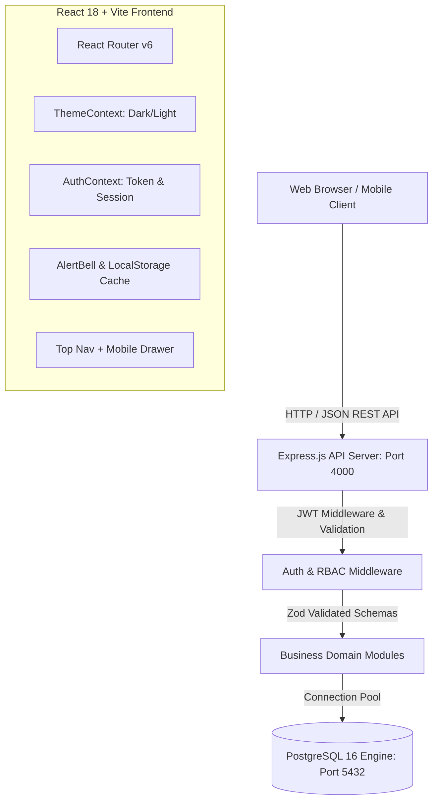
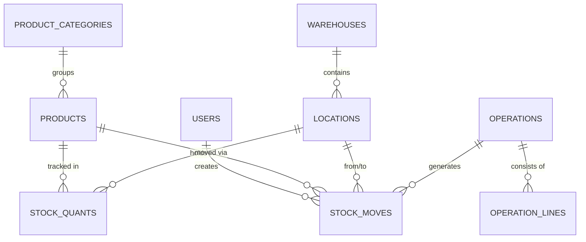

# StockSense — Comprehensive Project Documentation & Technical Report

> **Project Name:** StockSense  
> **Repository:** `Kavin-ks/StockSense`  
> **Active Branch:** `feature/user-profile` & `main` (commit `2a3611f`)  
> **Status:** Production-Ready & Verified Build  
> **Last Updated:** September 26, 2026  

---

## 1. Executive Summary & Vision

**StockSense** is an enterprise-grade Warehouse & Inventory Management System (WMS/IMS) designed for high-throughput tracking of physical stock. Built on the **double-entry stock movement principle** (similar to Odoo ERP and modern supply-chain logistics), every stock movement is recorded as a balanced transaction from a source location to a destination location, guaranteeing total auditability and zero phantom inventory drift.

The application combines a high-performance **PostgreSQL** relational core with a **Vite + React** single-page frontend styled using an **industrial design system** supporting dark/light modes, live notification triggers, and desktop + mobile navigation workflows.

---

## 2. Technical Stack & System Architecture



### Technology Breakdown

| Layer | Technologies Used | Key Responsibilities |
|---|---|---|
| **Frontend Framework** | React 18, Vite 8.3+, React Router DOM v6 | Fast SPA rendering, route transitions, modular pages |
| **Icons & UI** | Lucide React | Visual icons for operations, entities, and statuses |
| **Styling & Theme** | Vanilla CSS with Design Tokens | Zero-runtime CSS variables, dark/light themes, fluid responsive layout |
| **Backend Framework** | Node.js (v20+), Express.js | REST API routing, rate limiting, CORS, error handling |
| **Validation** | Zod (v3.23+) | Request payload schema validation and sanitation |
| **Database** | PostgreSQL 16 (Dockerized) | ACID transactions, foreign keys, numeric precision |
| **Authentication** | JSON Web Tokens (`jsonwebtoken`), bcryptjs | Stateless auth, salted password hashing |
| **Storage / Cache** | Browser `localStorage` | Token persistence, theme mode, dismissed notification keys |

---

## 3. Database Architecture & Double-Entry Ledger

StockSense utilizes a normalized relational schema with strict check constraints:



### Core Tables Summary

1. **`users`**: User identities, roles (`MANAGER`, `USER`), password hashes, department, contact, and audit metadata.
2. **`warehouses`**: Physical facilities (e.g., Main Warehouse, Secondary Hub) with unique short codes.
3. **`locations`**: Internal racks/bins, as well as virtual partner locations (`vendor`, `customer`, `inventory_loss`).
4. **`product_categories`**: Hierarchical classification for items.
5. **`products`**: Item masters with SKU, barcodes, units of measure, sale price, cost price, and active statuses.
6. **`stock_quants`**: Real-time physical quantities aggregated by `(product_id, location_id)`.
7. **`stock_moves`**: The immutable double-entry ledger. Every receipt, delivery, transfer, or adjustment creates explicit move records.
8. **`operations` & `operation_lines`**: Multi-line documents (Receipts, Delivery Orders, Internal Transfers, Inventory Adjustments) with state progression: `DRAFT` -> `WAITING` -> `READY` -> `DONE` -> `CANCELLED`.
9. **`reorder_rules`**: Automated replenishment minimum and maximum stock level thresholds.

---

## 4. Key Work & Features Implemented

### 4.1. Desktop & Mobile Navigation System
- **Desktop Horizontal Top Navbar**:
  - Centered navigation links with single-column vertical dropdowns for `Operations`, `Products`, and `Settings`.
  - Brand identity (Logo + StockSense) pinned to the far left.
  - Quick utility cluster (Theme switcher, Notification Bell, User Avatar menu) on the far right.
  - Dropdown rows feature custom icon badges, descriptive subheadings, and hover states.
- **Mobile Responsive Slide-Over Drawer**:
  - Activated by the top 3-line hamburger menu button (`<Menu />`) on screens <= 1024px.
  - Smooth slide-in sidebar from the left with backdrop scrim.
  - Nested category tree:
    - **Dashboard**
    - **OPERATIONS**: Receipts, Deliveries, Internal Transfers, Adjustments
    - **PRODUCTS**: Products, Stock Quants, Categories, Move History
    - **SETTINGS**: Warehouses, Locations
  - Pinned bottom profile footer with user initials avatar, user name, role, and quick Logout button.
  - Automatic dismissal when clicking links or backdrop.

### 4.2. Low-Stock Alerts & Dismissal Logic
- **Header Alert Bell**: Live badge counter fetching products where on-hand quantity <= reorder minimum.
- **Redirect on Click**: Clicking any notification immediately routes the user to that product's detail page (`/products/:id`).
- **Instant Dismissal**:
  - The clicked notification is immediately removed from the active list.
  - Other unread notifications remain visible.
  - Dismissed states are persisted in `localStorage` under `stocksense_read_alerts` using composite key `${productId}-${warehouseName}` so alerts do not re-appear on page refresh.
- **Quick Dismiss & Clear All**:
  - Individual `X` button on hover for direct dismissal without navigating.
  - "Mark all read" button in dropdown header.
  - "All caught up!" clean state with `<CheckCircle2 />` icon when all alerts are cleared.

### 4.3. User Profile & Account Settings (`/profile`)
- **Hero Banner**: Gradient badge with initials avatar, verification pill, system login ID with copy-to-clipboard, and account join date.
- **Personal Details**: Form for updating Full Name, Email, Contact Phone, and Department.
- **Warehouse Defaults**: Hub assignments, default landing screen preference, and date format configuration.
- **Alert Triggers**: Configurable stock minimum threshold alerts and email notification preferences.
- **Security & Authentication**:
  - Current password verification and new password complexity enforcement.
  - Active Session details card displaying detected client platform (Windows PC · Chrome Browser) and IP address.
- **Optimized UI**: Removed redundant tabs (Theme & Display, Export Config) as requested.

### 4.4. Operations Engine & Stock Movements
- **Receipts**: Inward dock receiving from vendor partners with batch validation.
- **Deliveries**: Outward shipment picking, packing, and validation decrementing stock quants.
- **Internal Transfers**: Relocation of items between warehouse bins and locations.
- **Adjustments**: Physical count variance reconciliation creating compensatory `inventory_loss` or gain moves.
- **Live Move History**: Chronological, searchable audit trail of all transactions with product, from/to locations, quantities, and user stamps.

---

## 5. Repository File Map

```
StockSense/
├── client/                               # Frontend Single Page App (Vite + React)
│   ├── public/logo.svg                   # Brand vector icon
│   ├── src/
│   │   ├── api/
│   │   │   ├── client.js                 # Axios/Fetch HTTP wrapper with Bearer token
│   │   │   └── endpoints.js              # API client methods for all backend routes
│   │   ├── components/
│   │   │   ├── AlertBell.jsx             # Notification bell with click-to-dismiss logic
│   │   │   ├── DataTable.jsx             # Reusable paginated data grid with sorting
│   │   │   ├── FilterBar.jsx             # Search, filter, and state toggles
│   │   │   ├── KanbanBoard.jsx           # Drag-and-drop / stage pipeline views
│   │   │   ├── Layout.jsx                # Top horizontal navbar + mobile slide-in drawer
│   │   │   ├── PasswordRequirements.jsx  # Real-time password strength validator
│   │   │   ├── ProtectedRoute.jsx        # Route auth guard
│   │   │   ├── ThemeToggle.jsx           # Dark / Light theme toggle button
│   │   │   └── ui.jsx                    # Button, Input, Select, Modal, Alert primitives
│   │   ├── context/
│   │   │   ├── AuthContext.jsx           # User session, login, logout, profile state
│   │   │   ├── ThemeContext.jsx          # Theme resolution (light / dark / system)
│   │   │   └── ToastContext.jsx          # Toast notification alerts
│   │   ├── pages/
│   │   │   ├── DashboardPage.jsx         # Executive KPIs, stock graphs, velocity
│   │   │   ├── MoveHistoryPage.jsx       # Immutable stock move audit ledger
│   │   │   ├── ProfilePage.jsx           # User profile and security settings
│   │   │   ├── auth/                     # Login, Signup, Forgot Password
│   │   │   ├── operations/               # Receipts, Deliveries, Transfers, Adjustments
│   │   │   ├── products/                 # Product List, Form, Categories
│   │   │   └── settings/                 # Warehouses and Locations
│   │   ├── styles/global.css             # Comprehensive design system stylesheet
│   │   ├── utils.js                      # Formatters (quantities, currency, dates)
│   │   └── App.jsx                       # Master React router & route declarations
│   └── vite.config.js                    # Vite configuration
│
├── server/                               # Backend REST API Server (Node + Express)
│   ├── src/
│   │   ├── app.js                        # Express app config, middleware, routes
│   │   ├── server.js                     # HTTP server startup & port binding
│   │   ├── config/env.js                 # Environment variable validation
│   │   ├── db/
│   │   │   ├── pool.js                   # pg Pool client with connection logging
│   │   │   ├── migrate.js                # Migration runner
│   │   │   ├── seed.js                   # Initial seed data script
│   │   │   └── migrations/001_init.sql   # Complete database schema & virtual locations
│   │   ├── middleware/                   # auth, errorHandler, validate
│   │   ├── modules/                      # auth, dashboard, operations, products, stock, warehouses
│   │   └── utils/                        # AppError, mailer, schemas
│   └── package.json
│
├── docs/                                 # Architecture specs & implementation guides
└── README.md                             # Project setup instructions
```

---

## 6. How to Run Locally

### Prerequisites
- Node.js >= 20
- Docker & Docker Compose (or local PostgreSQL 16)
- Git

### Step-by-Step Setup

1. **Start PostgreSQL Database**:
   ```bash
   docker run --name stocksense-db -e POSTGRES_USER=postgres -e POSTGRES_PASSWORD=postgres -e POSTGRES_DB=stocksense -p 5432:5432 -d postgres:16
   ```

2. **Configure & Run Backend**:
   ```bash
   cd server
   npm install
   npm run migrate    # Applies 001_init.sql
   npm run seed       # Populates default warehouse, locations & products
   npm run dev        # Starts backend on http://localhost:4000
   ```

3. **Configure & Run Frontend**:
   ```bash
   cd client
   npm install
   npm run dev        # Starts client on http://localhost:5173
   ```

4. **Login Credentials (Seed Data)**:
   - **Login ID**: `arivu12345` (or `manager@stocksense.local`)
   - **Password**: `StockSense@2026`

---

## 7. Current Git History & Synchronization

The project is currently cleanly synced:
- **`origin/main`**: Commit `2a3611f` (`feat(mobile-nav): restore classic slide-over sidebar with nested groups for mobile`)
- **`origin/feature/user-profile`**: Commit `2a3611f`
- **Build Status**: Verified via `npm run build` (0 errors, 1927 modules transformed cleanly).